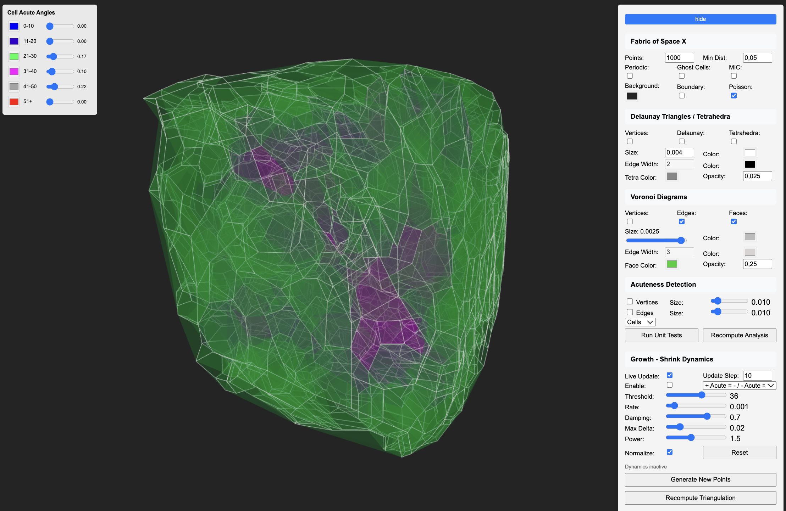
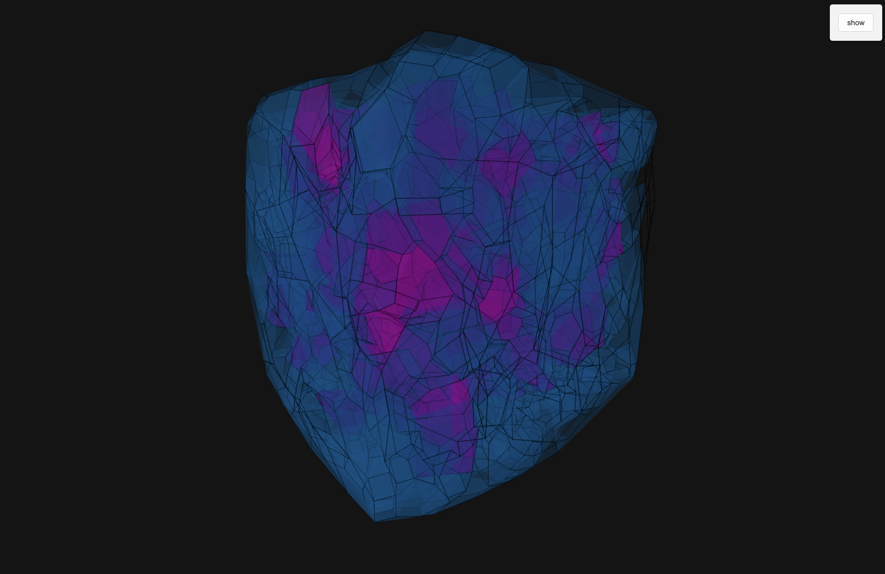
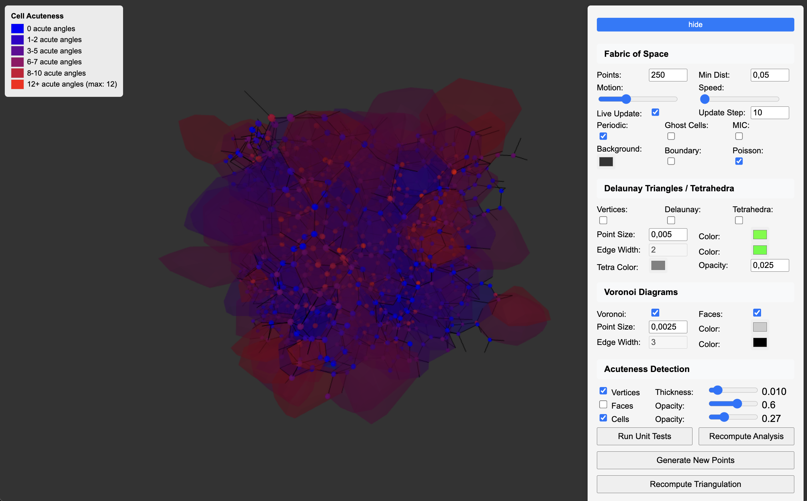
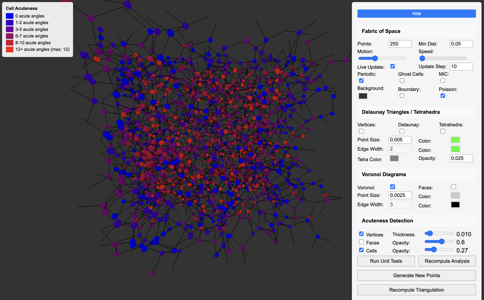
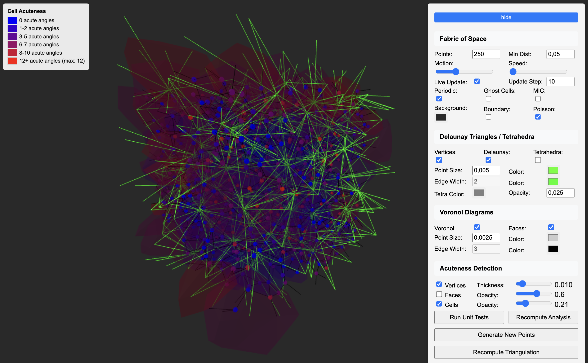
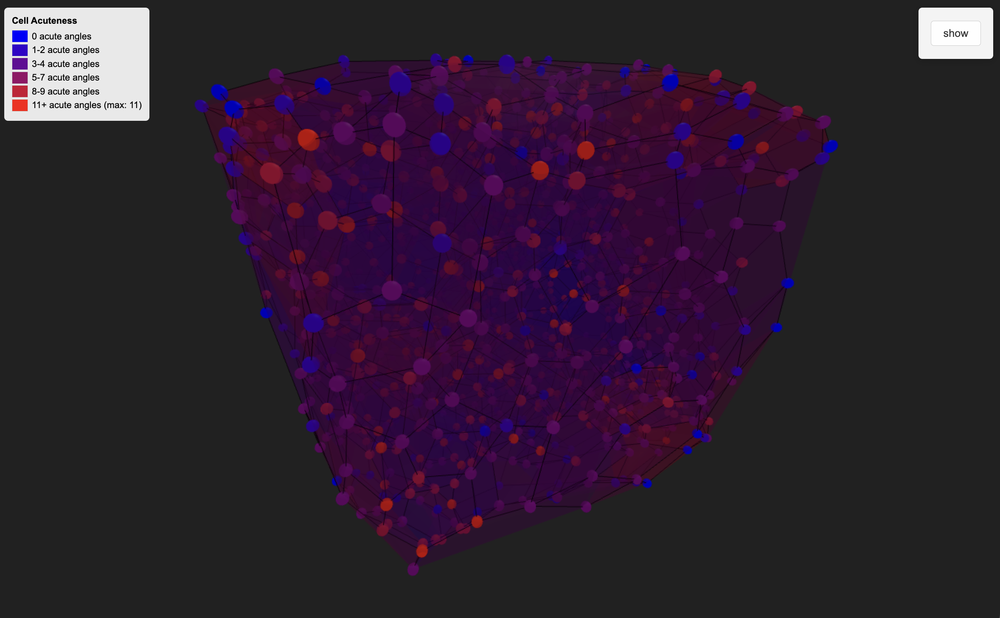

# Fabric-of-Space-X

[Live Demo](https://virtualorganics.github.io/Fabric-of-Space-X/)

An advanced 3D computational geometry visualization tool with **acuteness detection** capabilities, built upon the foundation of [Geogram-Three.js](https://github.com/VirtualOrganics/Geogram-Three.js). This project combines the computational power of [Geogram](https://github.com/BrunoLevy/geogram) with [Three.js](https://github.com/mrdoob/three.js) visualization and adds sophisticated geometric analysis features.

<p align="center">
  
   
</p>
<p align="center">
  
   
</p>
<p align="center">
  
  
</p>

## 🌟 Key Features

### **Core Capabilities**
- **3D Delaunay Triangulation**: Compute Delaunay tetrahedralization of 3D point sets
- **3D Voronoi Diagrams**: Generate Voronoi cells from Delaunay triangulation
- **Periodic Boundary Conditions**: Support for periodic (toroidal) domains
- **WebAssembly Performance**: Native-speed computation in the browser
- **Interactive 3D Visualization**: Real-time Three.js rendering with orbit controls
- **Growth-Shrink Dynamics**: Cells grow or shrink based on their acuteness (NEW in X version!)

### **🔍 Acuteness Detection System** *(New!)*
Advanced geometric analysis tools that detect and visualize acute angles in 3D structures:

- **📐 Cell Acuteness**: Analyzes dihedral angles between adjacent faces in Voronoi cells
- **🔲 Face Acuteness**: Counts acute interior angles in Voronoi face polygons  
- **⚫ Vertex Acuteness**: Measures acute angles in Delaunay tetrahedra vertices
- **🎨 Color-Coded Visualization**: Blue-to-red gradient (blue = low acuteness, red = high acuteness)
- **📊 Interactive Legend**: Real-time color scale showing acuteness levels
- **🧪 Unit Testing**: Comprehensive test suite with geometric validation
- **⚡ Performance Optimized**: Handles 1000+ points with live updates at 30+ FPS

### **⚡ Performance Optimizations** *(New!)*
Sophisticated optimization system for handling large datasets:

- **FastAcuteness Engine**: Optimized analyzer for 500+ points
  - Pre-allocated typed arrays minimize garbage collection
  - Inline calculations without intermediate allocations
  - Smart neighbor limiting (checks 4-6 nearest instead of all)
  - Incremental updates for live animation
  
- **Adaptive Quality System**: Maintains smooth 30 FPS
  - Automatically reduces quality when performance drops
  - Frame skipping for complex computations
  - Progressive rendering for large datasets
  
- **Web Workers**: Parallel computation support
  - Automatic worker pool management
  - Chunk-based processing
  - Graceful fallback to single-threaded mode

- **Optimized Algorithms**:
  - Squared distance calculations (avoids expensive sqrt)
  - Early termination for high-acuteness cells
  - Optional performance profiling

### **🌱 Growth-Shrink Dynamics** *(New in X!)*
Revolutionary cell dynamics based on geometric properties:

- **4 Growth Modes**:
  - **+ Acute = + (only)**: Only cells above threshold grow
  - **+ Acute = + / - Acute = -**: Bidirectional growth/shrink
  - **+ Acute = - (only)**: Only cells above threshold shrink
  - **+ Acute = - / - Acute = +**: Inverse bidirectional
  
- **Dynamic Controls**:
  - Adjustable threshold (0-60)
  - Growth rate and damping
  - Power factor for non-linear dynamics
  - Real-time statistics display
  
- **Maintains Voronoi Structure**: 
  - Never directly edits polygons
  - Only moves generator points
  - Rebuilds Delaunay→Voronoi each frame

## 🚀 Quick Start

### Online Demo
Try it instantly: **[Live Demo](https://virtualorganics.github.io/Fabric-of-Space-X/)**

### Local Development
```bash
# Clone the repository
git clone https://github.com/VirtualOrganics/Fabric-of-Space-X.git
cd Fabric-of-Space-X

# Start local server
python3 -m http.server 8000

# Open browser
open http://localhost:8000
```

## 🎮 Usage Guide

### Basic Controls
- **Points**: Number of random points to generate (4-2500)
- **Min Dist**: Minimum distance between generated points
- **Motion/Speed**: Point animation settings
- **Live Update**: Real-time triangulation updates
- **Periodic**: Toggle periodic boundary conditions
- **Ghost Cells**: Visualize periodic space wrapping

### 🔍 Acuteness Detection Controls
1. **Vertices Checkbox**: Toggle vertex acuteness visualization
2. **Analysis Mode Dropdown**: 
   - **None**: Standard visualization without analysis
   - **Faces**: Color individual Voronoi faces by their acute angles
   - **Cells**: Color entire Voronoi cells by total acute angles (default)
3. **Opacity Slider**: Control transparency of face/cell coloring
4. **Thickness Slider**: Control size of vertex spheres
5. **Run Unit Tests**: Execute geometric validation tests
6. **Recompute Analysis**: Refresh analysis on current data

### Color Legend
- **🔵 Blue**: Low acuteness (few acute angles)
- **🟢 Green**: Medium acuteness  
- **🟡 Yellow**: High acuteness
- **🔴 Red**: Maximum acuteness (many acute angles)

## 🔬 How the Model Works

### Mathematical Foundation

The Fabric-of-Space model is built on the duality between **Delaunay triangulation** and **Voronoi diagrams** in 3D space:

1. **Delaunay Triangulation**: Given a set of points in 3D, we compute a tetrahedralization where no point lies inside the circumsphere of any tetrahedron. This creates a network of tetrahedra that fills the convex hull of the points.

2. **Voronoi Diagram**: The dual of the Delaunay triangulation. Each Voronoi cell contains all points closer to its seed point than to any other seed point. The vertices of Voronoi cells are the circumcenters (barycenters) of Delaunay tetrahedra.

3. **Periodic Boundaries**: In periodic mode, the space wraps around like a 3D torus. Points near boundaries connect to points on the opposite side, creating a seamless, infinite tiling pattern.

### Implementation Architecture

```
Input Points → WASM Computation → JavaScript Processing → Three.js Visualization
     ↓               ↓                    ↓                      ↓
 3D Coordinates  Geogram Engine    Analysis & MIC         WebGL Rendering
                 (C++ via WASM)     Correction
```

#### 1. **WebAssembly Core (C++/Geogram)**
- Uses Geogram's robust geometric algorithms
- Computes Delaunay triangulation in native code speed
- Returns tetrahedra as vertex indices
- Handles periodic boundary conditions at the algorithmic level

#### 2. **JavaScript Processing Layer**
- **DelaunayComputation.js**: 
  - Manages WASM interface
  - Computes Voronoi vertices (tetrahedra barycenters)
  - Builds face adjacency relationships
  - Applies Minimum Image Convention (MIC) for periodic boundaries
  
- **GeometryAnalysis.js**:
  - Pure geometric calculations (no dependencies)
  - Computes angles between vectors
  - Counts acute angles in various contexts
  - Returns numerical scores for visualization

- **Visualizer.js**:
  - Maps analysis scores to colors
  - Creates Three.js meshes and materials
  - Manages color legends and UI updates

#### 3. **Three.js Visualization**
- Renders all geometric elements in real-time 3D
- Supports interactive camera controls
- Efficient mesh management and disposal
- Dynamic color updates based on analysis

### Acuteness Detection Algorithms

#### **Vertex Acuteness (Delaunay Tetrahedra Analysis)**
For each tetrahedron, we analyze the angles at each vertex:
```javascript
// For vertex V with edges to points A, B, C:
angle_AB_AC = arccos(dot(VA, VB) / (|VA| × |VB|))
angle_AB_BC = arccos(dot(VA, VC) / (|VA| × |VC|))
angle_AC_BC = arccos(dot(VB, VC) / (|VB| × |VC|))
// Count angles < 90° (π/2 radians)
```
This reveals "sliver" tetrahedra that indicate poor triangulation quality.

#### **Face Acuteness (Voronoi Face Polygon Analysis)**
For each Voronoi face (polygon between two cells):
1. Collect all tetrahedra containing both seed points
2. Extract their barycenters to form the face polygon
3. Sort vertices by angle to ensure proper polygon
4. Calculate interior angles at each vertex
5. Count angles < 90°

#### **Cell Acuteness (Voronoi Cell Analysis)**
For each Voronoi cell:
1. Collect all barycenters of tetrahedra containing the seed point
2. For each barycenter, find angles to nearby barycenters
3. Count all angles < 90° within the cell
4. Normalize by cell size for fair comparison

### Periodic Boundary Handling (MIC)

The **Minimum Image Convention** ensures correct visualization in periodic mode:
```javascript
// For any two points p1 and p2:
for each dimension i:
    delta = p2[i] - p1[i]
    if (delta > 0.5) p2[i] -= 1.0  // Wrap around
    if (delta < -0.5) p2[i] += 1.0  // Wrap around
```
This prevents "transverse connections" across boundaries and maintains local geometry.

### Performance Optimizations

1. **Efficient Data Structures**:
   - Face-to-tetrahedra adjacency maps
   - Cached barycenter calculations
   - Pre-sorted vertex arrays

2. **Mesh Management**:
   - Geometry disposal on updates
   - Material reuse where possible
   - Batched Three.js operations

3. **Algorithmic Efficiency**:
   - O(n log n) Delaunay triangulation
   - Linear-time Voronoi construction
   - Localized angle calculations

## 🔬 How Growth-Shrink Dynamics Work

### From Acuteness to Physical Change

The growth system creates a feedback loop between geometric analysis and mesh dynamics:

<p align="center">
  
  
</p>

#### **1. Acuteness Analysis Phase**
Each Voronoi cell is analyzed for acute angles:
- **Cell Acuteness Score**: Count of acute dihedral angles (< 90°) between adjacent faces
- **Range**: Typically 0-20+ acute angles per cell
- **Meaning**: Higher scores = more "spiky" or irregular cells

#### **2. Growth Decision Phase**
Based on the cell's acuteness score and the threshold:
```javascript
// Determine growth direction based on mode and threshold
const isAboveThreshold = cellAcuteness > threshold;

switch(growthMode) {
  case '+ Acute = + (only)':
    // Only cells with high acuteness grow outward
    growthFactor = isAboveThreshold ? +1 : 0;
    break;
    
  case '+ Acute = + / - Acute = -':
    // High acuteness grows, low acuteness shrinks (default)
    growthFactor = isAboveThreshold ? +1 : -1;
    break;
    
  case '+ Acute = - (only)':
    // Only cells with high acuteness shrink inward
    growthFactor = isAboveThreshold ? -1 : 0;
    break;
    
  case '+ Acute = - / - Acute = +':
    // Inverse: high acuteness shrinks, low acuteness grows
    growthFactor = isAboveThreshold ? -1 : +1;
    break;
}
```

#### **3. Physical Movement Phase**
The growth factor determines how generator points move:
```javascript
// Calculate movement vector from generator to cell centroid
const toCentroid = [
  cellCentroid.x - generator.x,
  cellCentroid.y - generator.y,
  cellCentroid.z - generator.z
];

// Apply growth: positive = away from centroid, negative = toward centroid
generator.x += toCentroid.x * growthFactor * rate * deltaTime;
generator.y += toCentroid.y * growthFactor * rate * deltaTime;
generator.z += toCentroid.z * growthFactor * rate * deltaTime;
```

### 🔧 The Physical Mesh Transformation Process

Here's EXACTLY how acuteness values translate to mesh changes:

#### **Step 1: Calculate Cell Centroid**
For each Voronoi cell, we find its geometric center:
```javascript
// Collect all vertices of the Voronoi cell
const cellVertices = cell.faces.flatMap(face => face.vertices);

// Calculate centroid (average position)
const centroid = {
  x: cellVertices.reduce((sum, v) => sum + v.x, 0) / cellVertices.length,
  y: cellVertices.reduce((sum, v) => sum + v.y, 0) / cellVertices.length,
  z: cellVertices.reduce((sum, v) => sum + v.z, 0) / cellVertices.length
};
```

#### **Step 2: Determine Movement Direction**
Based on acuteness and growth mode:
```javascript
// Example: Cell has acuteness = 12, threshold = 10
// In "+ Acute = +" mode: 12 > 10, so growthFactor = +1

// Calculate vector FROM generator TO centroid
const direction = {
  x: centroid.x - generator.x,  // e.g., 0.3 - 0.2 = 0.1
  y: centroid.y - generator.y,  // e.g., 0.5 - 0.4 = 0.1
  z: centroid.z - generator.z   // e.g., 0.7 - 0.6 = 0.1
};
```

#### **Step 3: Apply the Movement**
The actual position change:
```javascript
// With growthFactor = +1, rate = 0.001, deltaTime = 16ms
const moveAmount = growthFactor * rate * deltaTime;  // +1 * 0.001 * 16 = 0.016

// POSITIVE growth (away from centroid = cell expands)
generator.x -= direction.x * moveAmount;  // 0.2 - (0.1 * 0.016) = 0.1984
generator.y -= direction.y * moveAmount;  // 0.4 - (0.1 * 0.016) = 0.3984
generator.z -= direction.z * moveAmount;  // 0.6 - (0.1 * 0.016) = 0.5984

// NEGATIVE growth (toward centroid = cell shrinks)
// Would be: generator.x += direction.x * moveAmount
```

#### **Step 4: Why This Changes the Mesh**
The KEY insight - moving the generator changes ALL its neighboring cells:

1. **Generator moves outward** → Its Voronoi cell EXPANDS
   - The "territory" it claims grows larger
   - Neighboring cells get compressed
   
2. **Generator moves inward** → Its Voronoi cell SHRINKS
   - The "territory" it claims gets smaller
   - Neighboring cells expand to fill the space

#### **Visual Example**
```
BEFORE (acuteness = 15, threshold = 10):
    N1 -------- N2
    |     G     |    G = Generator at (0.5, 0.5)
    |     •     |    C = Centroid at (0.5, 0.6)
    |     ↓     |    Cell is "spiky" (high acuteness)
    |     C     |
    N3 -------- N4

AFTER (growth mode "+ Acute = +"):
    N1 -------- N2
    |     •     |    G moved UP away from C
    |     G'    |    New position: (0.5, 0.492)
    |     ↑     |    Cell EXPANDED upward
    |     C     |    Neighbors compressed
    N3 -------- N4
```

#### **The Complete Transform Pipeline**
```javascript
// Every frame when growth is enabled:
1. analyzeAcuteness()      → cellScores = [12, 8, 15, 3, ...]
2. calculateMovements()    → deltas = [(0.01, -0.02, 0), ...]  
3. updateGenerators()      → points[i] += deltas[i]
4. recomputeDelaunay()     → new tetrahedra from moved points
5. rebuildVoronoi()        → new cells from new tetrahedra
6. updateThreeJS()         → new meshes rendered on screen
```

This is why you see cells "breathing" - generators are constantly moving based on their acuteness, which changes the Voronoi tessellation every frame!

#### **4. Mesh Reconstruction Phase**
After moving generators:
1. **Recompute Delaunay**: New triangulation with moved points
2. **Rebuild Voronoi**: Generate new cells from updated Delaunay
3. **Reanalyze Acuteness**: Calculate new scores for next frame
4. **Update Visualization**: Render new geometry with colors

This creates a dynamic system where:
- **Growing cells** push their generators outward → cells expand
- **Shrinking cells** pull their generators inward → cells contract
- **Neighbors adapt** automatically through Voronoi reconstruction
- **Topology preserved** through proper Delaunay-Voronoi duality

### Growth Settings Explained

<p align="center">
  
</p>

#### **Enable Checkbox**
- Turns the growth system on/off
- When off, points remain static

#### **Mode Dropdown**
Selects how acuteness translates to growth:
- **+ Acute = + (only)**: Selective growth - only "spiky" cells expand
- **+ Acute = + / - Acute = -**: Balanced dynamics - spiky cells grow, smooth cells shrink
- **+ Acute = - (only)**: Selective shrinking - only "spiky" cells contract
- **+ Acute = - / - Acute = +**: Inverse dynamics - smooth cells grow, spiky cells shrink

#### **Threshold Slider (0-60)**
- **Purpose**: Defines what counts as "high" acuteness
- **Low values (0-10)**: Most cells considered high-acuteness
- **Medium values (10-30)**: Balanced classification
- **High values (30-60)**: Only very spiky cells considered high-acuteness
- **Tip**: Watch the average cell acuteness in the status bar for reference

#### **Rate Slider (0.0001-0.01)**
- **Purpose**: Base speed of growth/shrink movement
- **Low values**: Slow, smooth transitions
- **High values**: Fast, dynamic changes
- **Default**: 0.001 for visible but controlled motion

#### **Damping Slider (0-1)**
- **Purpose**: Smooths movement over time (momentum)
- **0**: No damping - instant response
- **0.7**: Default - smooth, natural motion
- **1**: Maximum damping - very slow response
- **Effect**: Higher damping = more fluid, less jittery movement

#### **Max Delta Slider (0.001-0.1)**
- **Purpose**: Limits maximum movement per frame
- **Safety feature**: Prevents explosive growth
- **Low values**: Very stable, slow maximum speed
- **High values**: Allows rapid changes
- **Default**: 0.02 for good balance

#### **Power Slider (0.5-3)**
- **Purpose**: Non-linear scaling of growth rate
- **< 1**: Dampens differences (more uniform growth)
- **= 1**: Linear relationship
- **> 1**: Amplifies differences (more dramatic variation)
- **Default**: 1.5 for noticeable but not extreme effects

#### **Statistics Display**
Real-time feedback showing:
- **Growing**: Number of cells currently expanding
- **Shrinking**: Number of cells currently contracting  
- **Static**: Number of cells not moving (below threshold in "only" modes)

### Mathematical Details

The complete growth equation for each generator point:
```
Δp = (C - p) × sign × (|acuteness - threshold| / threshold)^power × rate × damping × dt

Where:
- p = current generator position
- C = cell centroid position
- sign = growth direction (+1 or -1)
- acuteness = cell's acute angle count
- threshold = user-defined threshold
- power = non-linear scaling factor
- rate = base movement speed
- damping = momentum factor
- dt = frame time delta
```

With the constraint: `|Δp| ≤ maxDelta`

This ensures:
- Movement is proportional to distance from threshold
- Direction depends on mode and threshold comparison
- Speed is controlled by rate and damping
- Power creates non-linear response curves
- Max delta prevents instability

## 🔬 Technical Details

### Acuteness Analysis Algorithms

#### **Cell Acuteness**
Analyzes 3D Voronoi cells for acute dihedral angles:
```javascript
// For each cell, calculate angles between adjacent Voronoi vertices
const angle = calculateAngle(vec1, vec2);
if (angle < Math.PI / 2) acuteCount++; // Count acute angles
```

#### **Face Acuteness** 
Examines 2D Voronoi faces for acute interior angles:
```javascript
// For each vertex in face, calculate interior angle
const vec1 = [prev[0] - curr[0], prev[1] - curr[1], prev[2] - curr[2]];
const vec2 = [next[0] - curr[0], next[1] - curr[1], next[2] - curr[2]];
const angle = calculateAngle(vec1, vec2);
```

#### **Vertex Acuteness**
Measures acute angles in Delaunay tetrahedra:
```javascript
// For each tetrahedron vertex, analyze edge angles
const edges = others.map(v => [v[0] - center[0], v[1] - center[1], v[2] - center[2]]);
const angles = [calculateAngle(edges[0], edges[1]), ...];
```

### Data Structures
- **`DelaunayComputation`**: Core triangulation and analysis engine
- **`GeometryAnalysis`**: Pure geometric calculation functions
- **`FastAcuteness`**: Optimized analyzer for large datasets (500+ points)
- **`WorkerManager`**: Web Worker pool for parallel computation
- **`Visualizer`**: Three.js rendering and color mapping
- **Unit Tests**: Comprehensive validation with known geometries

### Performance Implementation Details

#### **FastAcuteness Engine**
The FastAcuteness analyzer achieves 5-10x speedup through:
```javascript
// Pre-allocated typed arrays
this.vertexBuffer = new Float32Array(maxVertices * 3);
this.distanceBuffer = new Float32Array(maxVertices);

// Inline calculations without array operations
const dx = x2 - x1;
const dy = y2 - y1;
const dz = z2 - z1;
const distSq = dx*dx + dy*dy + dz*dz; // No sqrt needed
```

#### **Adaptive Quality System**
Maintains target FPS by dynamically adjusting computation:
```javascript
if (frameTime > targetFrameTime) {
    this.qualityLevel = Math.max(0.1, this.qualityLevel * 0.9);
    this.skipFrames = Math.min(5, this.skipFrames + 1);
}
```

#### **Incremental Updates**
Only recalculates affected cells during animation:
```javascript
// Track which cells have moved
const movedCells = this.findMovedCells(prevPositions, newPositions);
// Update only those cells
movedCells.forEach(cellId => this.updateCellAcuteness(cellId));
```

## 🧪 Testing

### Built-in Test Suite
The project includes extensive unit tests:
```javascript
// Test geometric correctness with known shapes
testCubeGeometry();           // All angles should be 90° (non-acute)
testRegularTetrahedronGeometry(); // All angles should be 60° (acute)
testTriangularPrism();        // Mixed angle validation
```

### Running Tests
1. Open the application in your browser
2. Click **"Run Unit Tests"** button
3. Check browser console for detailed results
4. All tests should pass with ✅ green checkmarks

## 📚 API Reference

### Core Classes

#### `DelaunayComputation`
```javascript
const computation = new DelaunayComputation(points, isPeriodic);
await computation.compute(wasmModule);

// Access results
const tetrahedra = computation.getDelaunayTetrahedra();
const cells = computation.getCells();
const faces = computation.getFaces();
const vertices = computation.getVertices();
```

#### `GeometryAnalysis`
```javascript
import { analyzeAcuteness, vertexAcuteness, faceAcuteness, cellAcuteness } from './src/js/GeometryAnalysis.js';

// Run comprehensive analysis
const results = analyzeAcuteness(computation);
// Returns: { vertexScores: [...], faceScores: [...], cellScores: [...] }

// Individual analyses
const vertexScores = vertexAcuteness(computation);
const faceScores = faceAcuteness(computation);
const cellScores = cellAcuteness(computation);
```

#### `Visualizer`
```javascript
import * as Visualizer from './src/js/Visualizer.js';

// Initialize with THREE.js objects
Visualizer.initVisualizer(THREE, ConvexGeometry);

// Apply analysis coloring
Visualizer.applyAnalysisColoring(scene, meshGroups, analysisResults, 'CELL', computation);

// Remove analysis coloring
Visualizer.removeAnalysisColoring();
```

## 📊 Analysis Results Interpretation

### Understanding Acuteness Scores
- **Score 0**: No acute angles detected (e.g., perfect cube)
- **Low Scores (1-3)**: Few acute angles, generally regular geometry
- **Medium Scores (4-8)**: Moderate acuteness, some geometric irregularity
- **High Scores (9+)**: Many acute angles, highly irregular or "spiky" geometry

### Geometric Insights
- **High Cell Acuteness**: Indicates cells with sharp internal corners
- **High Face Acuteness**: Shows faces with pointed vertices
- **High Vertex Acuteness**: Reveals "sliver" tetrahedra in triangulation

## 🏗️ Project Structure

```
Fabric-of-Space-X/
├── 📄 index.html              # Main application
├── 📂 src/
│   ├── 📂 js/
│   │   ├── DelaunayComputation.js  # Core computation engine
│   │   ├── GeometryAnalysis.js     # Acuteness analysis algorithms
│   │   ├── GrowthSystem.js         # Growth-shrink dynamics (NEW!)
│   │   └── Visualizer.js           # Three.js visualization
│   └── 📂 cpp/                     # WASM source (from Geogram)
├── 📂 test/
│   └── GeometryAnalysis.test.js    # Unit test suite
├── 📂 dist/                        # Compiled WASM files
└── 📂 docs/                        # Documentation assets
```

## 🔧 Building from Source

### Prerequisites
- Emscripten SDK (for WASM compilation)
- Node.js (for development)
- C++17 compiler
- Python 3 (for local server)

### Build Steps
```bash
# Build WASM module (if modifying C++ code)
cd src/cpp
./build.sh

# Start development server
python3 -m http.server 8000
```

## 🎯 Use Cases

### Research Applications
- **Computational Geometry**: Study Voronoi diagram properties
- **Materials Science**: Analyze crystal structure irregularities  
- **Biology**: Examine cellular arrangements and acute interfaces
- **Physics**: Investigate particle packing and sharp boundaries

### Educational Use
- **Geometry Visualization**: Interactive 3D geometric concepts
- **Algorithm Demonstration**: Real-time triangulation algorithms
- **Mathematical Analysis**: Acute angle detection in 3D space

## 🤝 Contributing

We welcome contributions! Areas for improvement:
- 🔬 Advanced analysis algorithms
- 🎨 Enhanced visualization options
- ⚡ Performance optimizations
- 📊 Export/import functionality
- 🧪 Additional test cases

## 📋 Roadmap

- [ ] 📈 Statistical analysis tools
- [ ] 💾 Data export (CSV, JSON)
- [ ] 🎛️ Advanced filtering options
- [ ] 🔍 Zoom-to-acute-regions feature
- [ ] 📱 Mobile-responsive design
- [ ] 🎯 Batch processing mode

## 📄 License

This project is licensed under the MIT License. See the LICENSE file for details.

## 🙏 Acknowledgments

- **[Geogram](https://github.com/BrunoLevy/geogram)** by Bruno Levy - Core geometric algorithms
- **[Three.js](https://github.com/mrdoob/three.js)** - 3D visualization framework  
- **[Emscripten](https://emscripten.org/)** - WebAssembly compilation
- **[Geogram-Three.js](https://github.com/VirtualOrganics/Geogram-Three.js)** - Foundation project

## 📞 Support

- 🐛 **Issues**: [GitHub Issues](https://github.com/VirtualOrganics/Fabric-of-Space/issues)
- 💬 **Discussions**: [GitHub Discussions](https://github.com/VirtualOrganics/Fabric-of-Space/discussions)
- 📧 **Contact**: Open an issue for questions

---

**Made with ❤️ for the computational geometry community**
